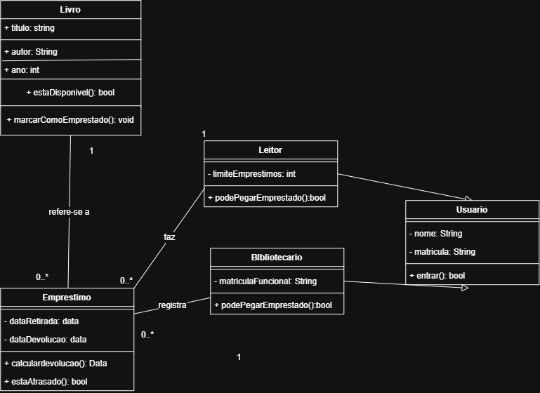

# Atividade 18 — Diagrama de Classes do BiblioTech
Nome: Artur Lacerda da Silva
Turma: 2º ano — Técnico em Informática Integrado

## Diagrama

## Por que estes números (associação Bibliotecario — Emprestimo)
- Perto de Emprestimo eu coloquei 0..* porque o bibliotecario nao tem limites de emprestimos que ele pode registar
- Perto de Bibliotecario eu coloquei 1 porque o emprestimo só pode ser registrado por um unico bibliotecario

## Rastreabilidade (nível B)
- A operação estaDisponivel() da classe Livro atende ao caso de uso Livro deve verificar quando e se está disponivel

## Autoavaliação
- Conceito que pretendo: A
- Onde isso se prova no diagrama (classe / linha / número): Todos as classes estao corretas e completas, completei o desafio da multiplicidade e formatei o diagrama